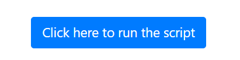
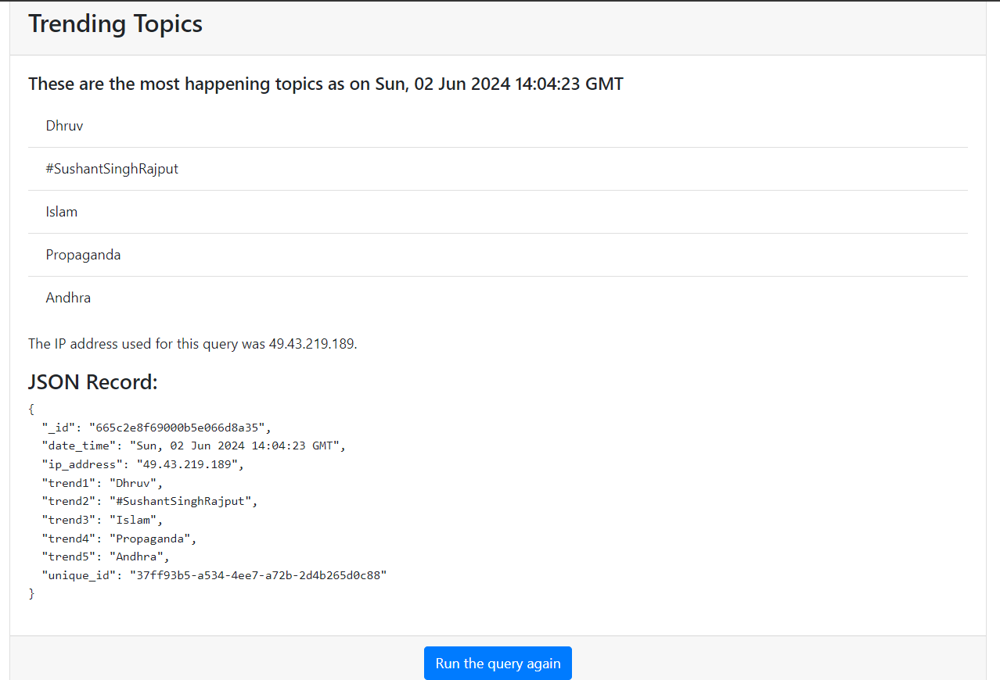

# Tech stack
- Automation - Selenium scripting
- Backend - Flask
- Database - MongoDB using pymongo
- Proxy - proxymesh (Rotating proxies)

# Installation
- Install the modules required using pip from the requiments.txt file
  ```
  pip install -r requirements.txt

- Create a file config.py in the source directory and add your twitter login details and proxy mesh server list.
  ```
  # Twitter credentials
  EMAIL = "your-twitter-email"
  PASSWORD = "your-twitter-password"
  USERNAME = "your-twitter-username"
  
  # Proxy details
  PROXY_LIST = [add-proxies]

- you can get the proxy servers from proxymesh website. you can get only one server for a free trail. So, for free trial you ultimately get only one server.
- run the server by executing backend.py. Open trends.html and click on the button to scrape twitter for top trending topics.

# Interface

After clicking the button you get the below result.


